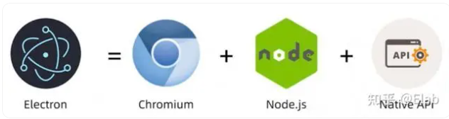
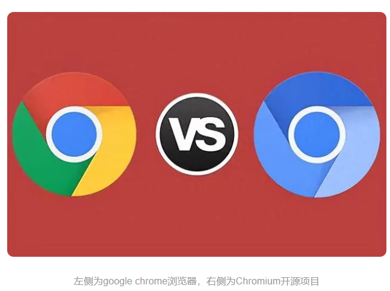

# Electron是什么？

Electron是一个使用 JavaScript、HTML 和 CSS 构建桌面应用程序的框架。 嵌入 [Chromium](https://www.chromium.org/) 和 [Node.js](https://nodejs.org/) 到 二进制的 Electron 允许您保持一个 JavaScript 代码代码库并创建 在Windows上运行的跨平台应用 macOS和Linux——不需要本地开发 经验。

## 什么是chromium

https://baijiahao.baidu.com/s?id=1786504848640933052&wfr=spider&for=pc

- **Chromium项目**：Chromium是一个完全开源的浏览器项目，其代码可以在Chromium的官方仓库中找到。任何人都可以查看、修改和构建Chromium的源代码。
- **核心功能**：Chromium包含了浏览器的大部分核心功能，包括HTML渲染引擎（Blink）、JavaScript引擎（V8）、以及其他用于浏览网页的基础功能。

Chromium是一款开源的**Web浏览器项目**，它由Google主导开发，并且是Google Chrome浏览器的基础。Chromium项目的目标是构建一个快速、稳定、安全的Web浏览器，提供先进的Web技术支持和良好的用户体验。

**是一个通用的浏览器内核架构**

以下是一些关于Chromium的重要特点和信息：

**1. 开源性**：Chromium是一个完全开源的项目，任何人都可以访问和查看其源代码。这使得开发者可以自由地修改和定制Chromium，以满足特定需求。

**2. 快速和高效**：Chromium采用了V8 JavaScript引擎和Blink渲染引擎，这使得它能够快速加载和渲染网页内容，提供流畅的浏览体验。

**3. 安全性：**Chromium致力于保护用户的隐私和安全。它具有内置的安全功能，如沙盒隔离、安全浏览、自动更新等，以防止恶意软件和网络攻击。

**4. 跨平台支持：**Chromium可在多个操作系统上运行，包括Windows、macOS、Linux和Android。这使得用户可以在不同设备上享受一致的浏览器体验。

**5. 扩展性：**Chromium支持丰富的扩展和插件，用户可以根据自己的需求添加各种功能和定制化选项，以满足个人化的浏览需求。

**6. 开发者工具：**Chromium提供了强大的开发者工具，如开发者控制台、调试工具、性能分析器等，帮助开发者进行Web应用程序的开发和调试。

总的来说，Chromium是一款功能强大、灵活可定制的Web浏览器，它的开源性和稳定性使其成为许多其他浏览器的基础，并且在开发者社区中得到广泛的支持和贡献。

360、QQ、edge、chrom等等这些都是**基于Chromium开发**的不同品牌和类型的Web浏览器，它们在功能和特色上可能有所差异，但都基于Chromium的开源代码，并且提供了快速、安全、稳定的浏览体验。

### Chromium和操作系统 C/S架构软件的区别

**1. Chromium：**Chromium是一个Web浏览器项目，它的主要目标是提供一个快速、稳定、安全的浏览器，用于浏览和访问互联网上的网页和应用程序。Chromium是一个软件应用，它可以在多个操作系统上运行，包括Windows、macOS、Linux和Android。它的功能是通过解析HTML、CSS和JavaScript等Web技术来展示网页内容，并提供用户与网页交互的界面。

**2. 操作系统**：操作系统是一种软件，它是计算机系统的核心组件，负责管理和控制计算机的硬件和软件资源。操作系统提供了用户与计算机硬件和其他软件之间的接口，使得用户可以方便地使用和管理计算机系统。操作系统可以管理和运行各种应用程序，包括浏览器、办公软件、娱乐软件等。常见的操作系统包括Windows、macOS、Linux、iOS和Android等。

**C/S架构软件**是一种客户端/服务器架构的软件系统，其中客户端和服务器分别承担不同的角色和功能。客户端是指用户使用的界面和应用程序，而服务器是指提供服务和资源的主机。客户端和服务器之间通过网络进行通信和交互。

**区别：**

- Chromium是一款Web浏览器应用程序，而操作系统是计算机系统的核心软件。

- Chromium是一个特定功能的应用程序，用于浏览和访问互联网上的网页和应用程序。操作系统则是一个更加通用的软件，管理和控制计算机系统的各种资源和应用程序。

- C/S架构软件是一种软件架构模式，用于描述客户端和服务器之间的交互关系。Chromium和操作系统都可以是C/S架构软件的一部分，其中Chromium可以作为客户端应用程序，而操作系统可以作为服务器提供服务和资源。

总结：Chromium是一个Web浏览器应用程序，用于浏览和访问互联网上的网页和应用程序。操作系统是计算机系统的核心软件，管理和控制计算机的硬件和软件资源。C/S架构软件是一种软件架构模式，描述客户端和服务器之间的交互关系。

### Chromium和chrom是什么关系

**Chromium**

1. **开源项目**：Chromium是一个开源的浏览器项目，由Google发起和维护。它提供了基础代码，**用于开发各种浏览器**。
2. **浏览器**：Chromium浏览器是一个基于该开源项目的浏览器，它本身没有Google Chrome的一些专有功能，比如自动更新、PDF查看器、内置的Flash播放器、某些Google特有的服务等。
3. **开发基础**：很多其他浏览器，如Microsoft Edge、Opera、Brave等，都是基于Chromium项目的。

**Google Chrome**

1. **基于Chromium**：Google Chrome是Google基于Chromium项目开发的浏览器。它在Chromium的基础上添加了许多Google特有的功能和服务。
2. **专有功能**：Google Chrome包含了一些Chromium没有的专有功能，比如Google账号同步、Google云端打印、内置的PDF查看器、Flash支持、自动更新等。
3. **品牌和支持**：Chrome由Google品牌支持，提供了广泛的用户支持和定期更新。

**总结**

- **共同点**：Chromium和Google Chrome共享大部分代码库和核心功能。它们在渲染网页、执行JavaScript、支持现代网页标准等方面的表现非常相似。
- **区别**：主要在于Google Chrome添加了一些专有功能和服务，提供了额外的用户体验和便捷功能，而Chromium则是一个更为简化的开源版本。

Chromium是Chrome的基础代码库，而Chrome是基于Chromium开发的，添加了额外功能和品牌支持的浏览器。